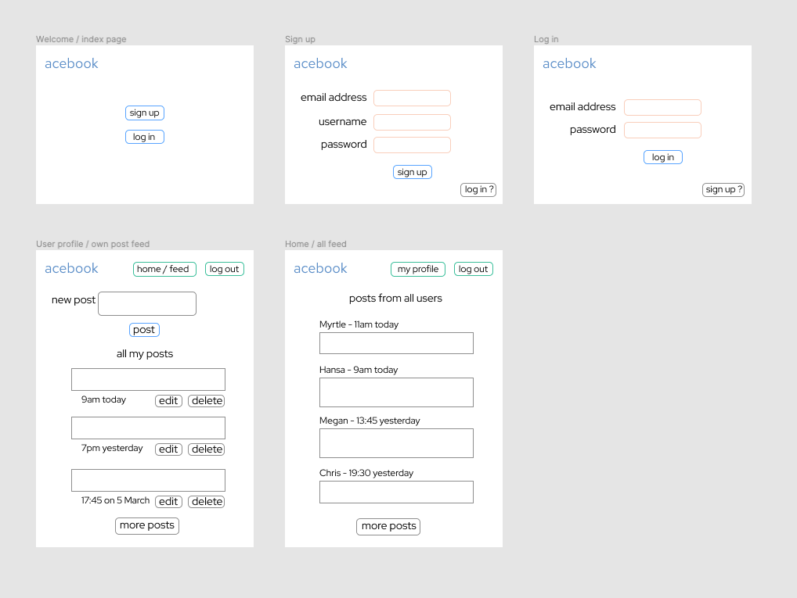

[](https://travis-ci.com/Megscode/acebook_undefined) <a href="https://codeclimate.com/github/Megscode/acebook_undefined/maintainability"></a> <a href="https://codeclimate.com/github/Megscode/acebook_undefined/test_coverage"></a>

# AceBook  

A clone of a well known posts-based website by team {undefined}. Created as part of Weeks 8 & 9 at [Makers Academy](https://makers.tech/).

## Usage
Sign up, sign in and create posts. You will be able to edit and delete your posts (but not ones created by others) using the buttons below each post.

## Installation
First, `git clone` this repository. Then:
```bash
> bundle install
> rails db:create
> rails db:migrate
> rails server
```

Alternately, you can use/view the project on Heroku [here](#nowhere).

## Technologies:
- Travis CI   [](https://travis-ci.org/Megscode/acebook_undefined)
- Code Climate & Rubocop gems for code quality
- Ruby on Rails
- postgreSQL & ActiveRecord 
- the Devise gem for user authentication
 

## Collaborators
* [Barri](https://github.com/BarriF13)
* [Chris](https://github.com/saidbyced)
* [Hansa](https://github.com/hansa-lallu)
* [Megan](https://github.com/Megscode)
* [Myrtle](https://github.com/Mrtly)
* [Paulo](https://github.com/Pazoia)

## Project details

### User Stories

A user can:
* [x] sign up with their email address and password
* [x] sign into the platform
* [x] create a post, edit and delete it
* [x] see all the posts in reverse chronological order
* [x] see who wrote each post & when
* [x] comment on a post
* [x] edit or delete their comments
* [x] see who commented & when
```
Under construction...
```

### Wireframes
1st wireframe <br>


### Project management
Trello: [Acebook-on-rails](https://trello.com/b/0B2v6FNT/acebook-on-rails)

## Acknowledgements
Everyone. But especially [LOLcats](http://www.lolcats.com/).
Also under construction...

---

> Strive for continuous improvement, instead of perfection.
>                                                Kim Collins
