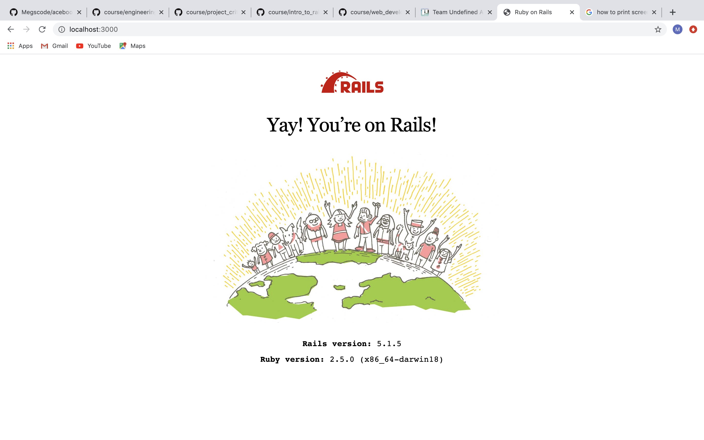
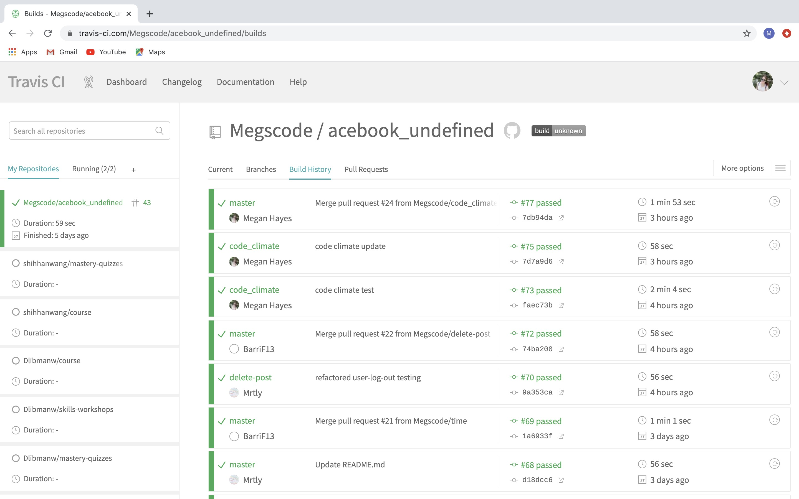
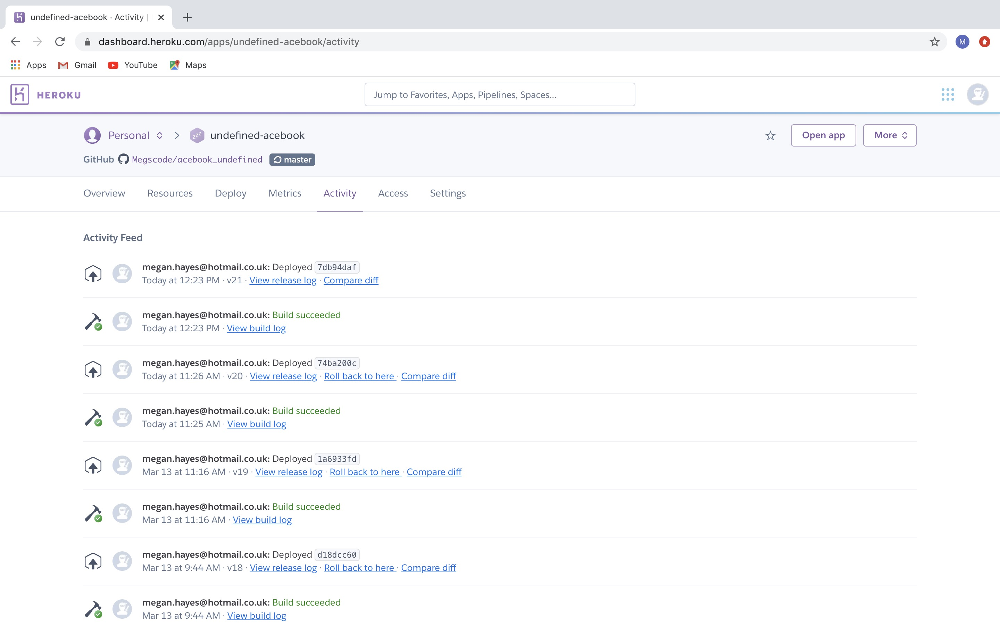
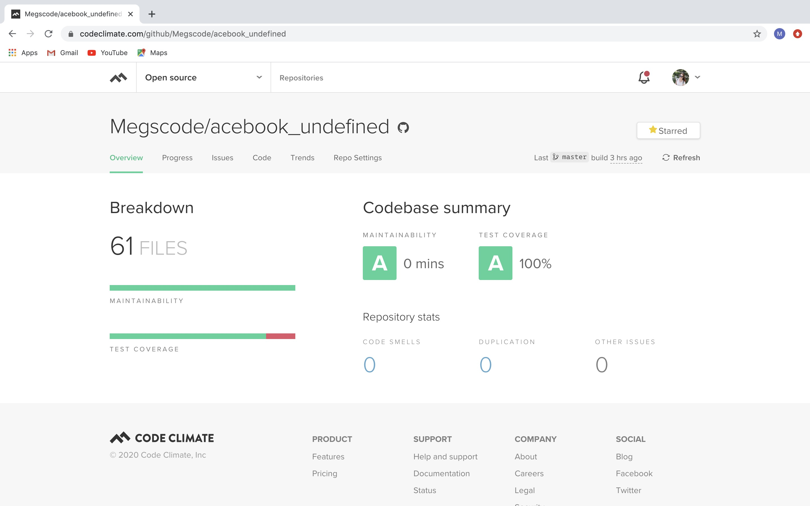
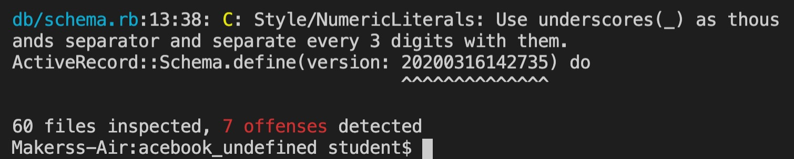

## A tour of team Undefined's Acebook tools

Our full stack web app inspired by Facebook, ‘Acebook’, is packed full of user friendly features;

Users can: 
* sign up, 
* log in
* post
* comment

Creating our web-app required a carefully selected mix of tools, technologies and gems. To ensure our code is high quality, mergeable and maintainable we tested it using Code Climate, Simple-cov, RuboCop and Travis. We used Ruby on Rails for efficient and speedy development, and we selected Heroku for deployment so that our app can evolve and grow seamlessly. 

### Ruby on Rails

* We used Ruby on Rails as our development framework. Rails enables quick and easy back-end web app development.
*  Ruby on Rails’s philosophy is to write less code that does more, we have found the Ruby on Rails framework to be extremely time efficient. 
* Ruby on Rails includes: Ruby language, Active Record, Action Pack, Action Mailer, Action Web Services and Prototype. 
* The prerequisites to installing Ruby on Rails on your project are Ruby and SQLite3. 
* Once you have installed Ruby and SQLite3 you can install rails by running '$ gem install rails’ from the command line. 

### Travis

* We used Travis Continuous Integration to build and test our project. 
* We integrated Travis CI into our code by adding a file named .travis.yml.
* Within our .travis.yml.  file we specified our programming language our build parameters and testing parameters.  
* Travis is linked to our web app via a webhook on our GitHub repository and in our Gemfile. 
* Travis checks our code externally at https://travis-ci.org/ during a Github pull request to ensure merges only happen between branches with passing code. 
* By using Travis we can be confident that our code is top quality.

Travis looks like this:

### Heroku 

* Heroku is a cloud platform that deploys, builds and manages our web app.
* Heroku is linked to our GitHub repository using a webhook. 
* Heroku is scalable and easily adapted to differing coding languages. 

Heroku looks like this: 

### Simple-cov

* Simple-cov provides test analyses for our Ruby code from within our local project file.
* The Simple-cov report is displayed in our terminal when we run tests on our code using Rspec. 
* As a team we decided that having an awareness of our code coverage is essential. By installing simple-cov we can see if there are any areas of our code that are poorly tested and therefore may cause problems further down the line. 
* Simple-cov is implemented into our project by writing to following code in our Gemfile, see below.

A simple-cov report: 

### Code Climate

* Code Climate tests the coverage and maintainability of our code externally, via https://codeclimate.com/
* Code Climate is linked to our GitHub repository using a Webhook. 
* Like Travis, Code Climate checks our code during a Github pull request to ensure merges only happen between branches with high quality code with parameters that we have selected.  
* Instructions to configure Code Climate: https://docs.codeclimate.com/docs/configuring-test-coverage#section-supported-languages-and-formats

Code Climate looks like this: 

### RuboCop

* RuboCop is a code formatter that helps to keep our code neat, tidy and syntactically correct. 
* It runs analyses on our code from the terminal and provides us with a report (example below).
* The report highlights ‘offences’ that refer to areas of our code that we can improve by implementing a simple syntax change.
* RuboCop is installed as a gem on our Gemfile. 

